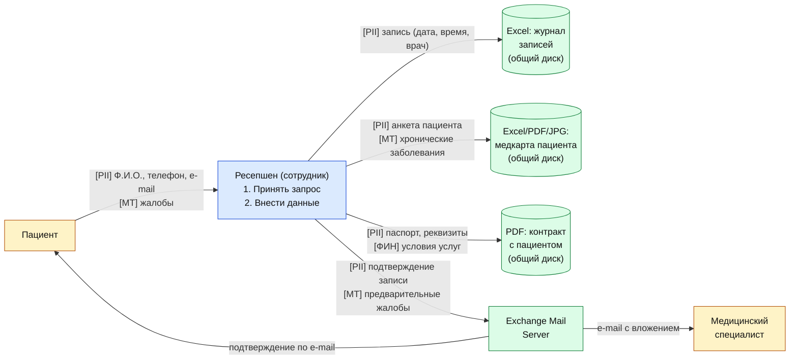

# DFD 1 — Запись пациента на приём (As-Is)

Процесс: пациент звонит/приходит на ресепшен; сотрудник заносит данные в журнал записи
(Excel) и в карту пациента; параллельно создаётся клиентский контракт (PDF/скан).

## Категории данных в потоке

| Метка | Категория | Поля |
|-------|-----------|------|
| `[PII]` | Персональные данные | Ф.И.О., дата рождения, телефон, e-mail, адрес, место работы |
| `[МТ]`  | Медицинская тайна | Жалобы, хронические заболевания, диагнозы, история обращений |
| `[ФИН]` | Финансовые данные | Прейскурант, сумма к оплате |

## Диаграмма

## Замечания As-Is

1. Данные пациента передаются по e-mail в открытом виде — медицинская тайна попадает
   на Exchange-сервер без шифрования сообщения.
2. Журнал записей лежит на общем диске; контроль доступа — только на уровне доменных
   групп AD, аудит чтения файла не настроен.
3. Контракт пациента (PDF) хранится в одной директории со всеми остальными — отсутствует
   разделение зон по чувствительности данных.
4. Каждый сотрудник ресепшена может видеть все записи всех специалистов и анкеты всех
   пациентов — нарушение принципа минимальных привилегий и data minimization.
