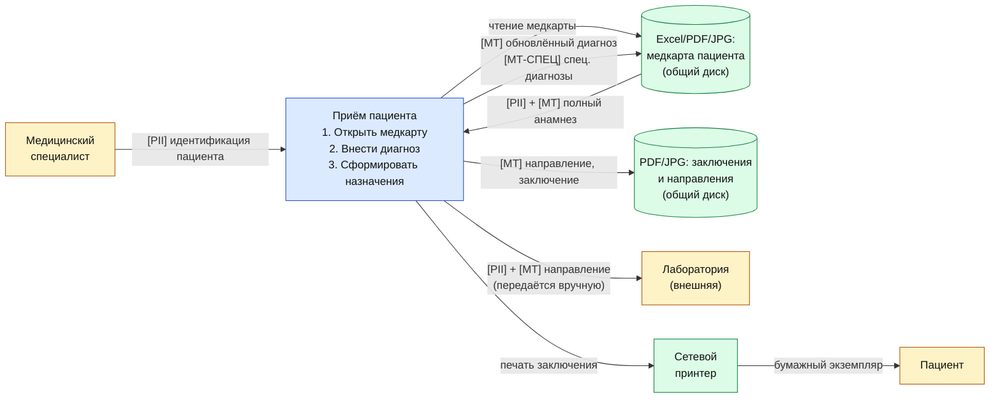

# DFD 2 — Приём специалистом и ведение медкарты (As-Is)

Процесс: медицинский специалист открывает медкарту пациента на общем диске, заполняет
данные приёма (диагноз, рекомендации), формирует направления на анализы, сохраняет
файл.

## Категории данных в потоке

| Метка | Категория | Поля |
|-------|-----------|------|
| `[PII]` | Персональные данные | Ф.И.О., дата рождения, контактные данные |
| `[МТ]`  | Медицинская тайна | Жалобы, анамнез, диагноз (МКБ-10), назначения, заключения |
| `[МТ-СПЕЦ]` | Особо чувствительные | ВИЧ, психиатрия, наркология, генетика |

## Диаграмма

## Замечания As-Is

1. Медкарта — обычный Excel/PDF на общем диске; конкуренция за файл (один пишет —
   остальные читают устаревшую копию), нет версионности и журнала изменений.
2. Особо чувствительные диагнозы (ВИЧ, психиатрия) хранятся вместе с обычными — нет
   разделения по уровням чувствительности и доменам.
3. Передача направления в лабораторию идёт «руками» (распечатка, e-mail, флешка) —
   утечка по неконтролируемому каналу.
4. Сетевой принтер — частый канал утечки: документы остаются в очереди, не
   шифруются, забираются не тем сотрудником.
5. Отсутствие журнала доступа: невозможно установить, кто и когда читал медкарту.
