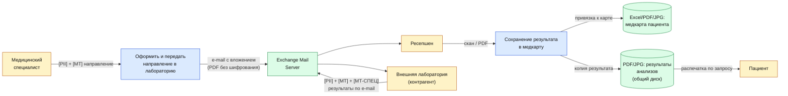

# DFD 3 — Лабораторные анализы (As-Is)

Процесс: специалист передаёт направление в лабораторию; забор материала
(внутри клиники или внешний); лаборатория возвращает результат в виде PDF/JPG;
специалист или ресепшен сохраняют его в медкарту пациента.

## Категории данных в потоке

| Метка | Категория | Поля |
|-------|-----------|------|
| `[PII]` | Персональные данные | Ф.И.О., дата рождения, СНИЛС, контакты |
| `[МТ]`  | Медицинская тайна | Тип анализа, биоматериал, числовые показатели |
| `[МТ-СПЕЦ]` | Особо чувствительные | ВИЧ, гепатиты, генетика, онкомаркеры |

## Диаграмма

## Замечания As-Is

1. Обмен с внешней лабораторией идёт по e-mail без шифрования вложений и без подписи —
   данные могут быть перехвачены и подменены, идентификация контрагента отсутствует.
2. Отсутствует формализованный договор о трансграничной/межсубъектной передаче ПДн,
   нет согласия пациента на передачу данных в лабораторию.
3. Результаты дублируются в двух местах (`медкарта` и `результаты анализов`) — нарушение
   data minimization, риск рассинхронизации.
4. Особо чувствительные результаты (ВИЧ, гепатиты) лежат вместе с обычными биохимическими.
5. Доступ к результатам анализов — у всех сотрудников ресепшена, хотя они не должны видеть
   медицинский смысл показателей.
