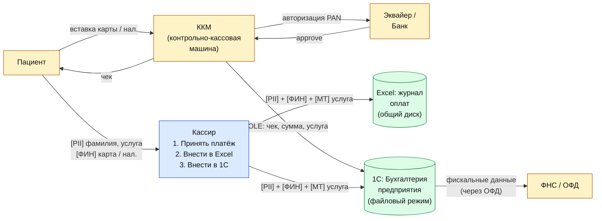

# DFD 4 — Приём оплаты услуг (As-Is)

Процесс: после приёма пациент идёт в кассу; кассир принимает оплату (наличные или
карта через ККМ); параллельно вносит платёж в Excel и в 1С:Бухгалтерия предприятия.

## Категории данных в потоке

| Метка | Категория | Поля |
|-------|-----------|------|
| `[PII]` | Персональные данные | Ф.И.О. плательщика, телефон |
| `[ФИН]` | Финансовые / платёжные | Сумма, тип услуги, способ оплаты, PAN (маскированный) |
| `[МТ]`  | Медицинская тайна | Код услуги = диагноз/направление |

> Связка «услуга + плательщик» по факту разглашает медицинский профиль пациента,
> поэтому платёжные данные относятся не только к `[ФИН]`, но и косвенно к `[МТ]`.

## Диаграмма

## Замечания As-Is

1. **Двойной ввод** в Excel и 1С — источник расхождений и нагрузка на персонал; Excel
   при этом не имеет журнала, его можно отредактировать задним числом.
2. **Связка «услуга ↔ пациент»** в Excel-журнале оплат фактически делает его носителем
   медицинской тайны, хотя хранится он как обычный финансовый отчёт.
3. **1С: Бухгалтерия в файловом режиме** — отсутствует разграничение доступа на уровне
   ролей: либо «всё», либо «ничего». Аудит действий минимален.
4. **OLE-интеграция ККМ с 1С** работает в открытой локальной сети без TLS — возможен
   перехват/подмена данных платежа внутри LAN.
5. Кассир имеет полный доступ к Ф.И.О. и услуге всех пациентов клиники.
