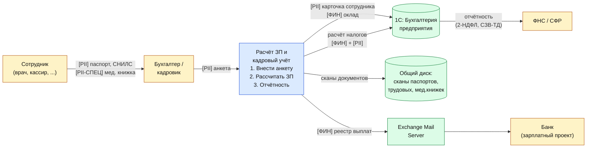

# DFD 5 — Бухгалтерия, зарплаты, кадровый учёт (As-Is)

Процесс: бухгалтерия обрабатывает выручку из 1С, ведёт расчёт зарплаты, кадровый учёт
(приём, увольнение, отпуска), готовит отчётность в ФНС, СФР, банки.

## Категории данных в потоке

| Метка | Категория | Поля |
|-------|-----------|------|
| `[PII]` | Персональные данные сотрудников | Ф.И.О., паспорт, СНИЛС, ИНН, адрес, банковские реквизиты |
| `[PII-СПЕЦ]` | Специальные категории ПДн | Состояние здоровья (больничные), судимость, гражданство |
| `[ФИН]` | Финансовые данные | Оклады, премии, налоги, выручка |

## Диаграмма

## Замечания As-Is

1. Сканы паспортов, мед. книжек и трудовых лежат на общем диске единым каталогом — нет
   ни шифрования, ни деления на доступы.
2. Реестры на выплату ЗП отправляются в банк по обычному e-mail (Exchange) с XLS/PDF —
   часто без пароля на архив.
3. 1С в файловом режиме не разграничивает доступ к финансовым показателям, бухгалтер
   видит всех сотрудников всех отделов.
4. Кадровые данные хранятся бессрочно — нарушение принципа ограничения сроков
   хранения (ст. 5 152-ФЗ).
5. Отсутствует журнал аудита — невозможно установить, кто и когда менял зарплатные
   ведомости.
