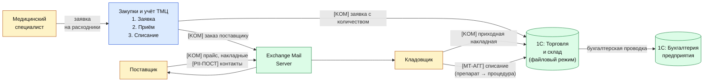

# DFD 6 — Учёт ТМЦ и закупки (As-Is)

Процесс: склад ведёт учёт расходных материалов, медикаментов, оборудования; формирует
заявки на закупку; принимает поставки от поставщиков. Программа «1С:Торговля и склад»
интегрирована с «1С:Бухгалтерия предприятия».

## Категории данных в потоке

| Метка | Категория | Поля |
|-------|-----------|------|
| `[KOM]`     | Коммерческая тайна | Цены поставщиков, объёмы закупок, маржа |
| `[PII-ПОСТ]` | ПДн контрагентов | Контакты представителей поставщика |
| `[МТ-АГГ]`  | Косвенно медицинская | Списания препаратов = профиль лечения клиники |

## Диаграмма

## Замечания As-Is

1. Аналитика списания препаратов агрегированно раскрывает специализацию клиники и
   профиль лечения пациентов — это косвенно конфиденциальная информация.
2. Переписка с поставщиками по обычному e-mail — утечка коммерческой тайны (цены,
   объёмы) и контактов представителей.
3. «1С:Торговля и склад» в файловом режиме — нет разграничения доступа, кладовщик
   видит все цены, все остатки, все накладные.
4. Отсутствуют формализованные NDA / DPA с поставщиками медицинских препаратов.
5. Нет автоматизированной сверки списания препарата с конкретной процедурой —
   возможны злоупотребления (хищение).
