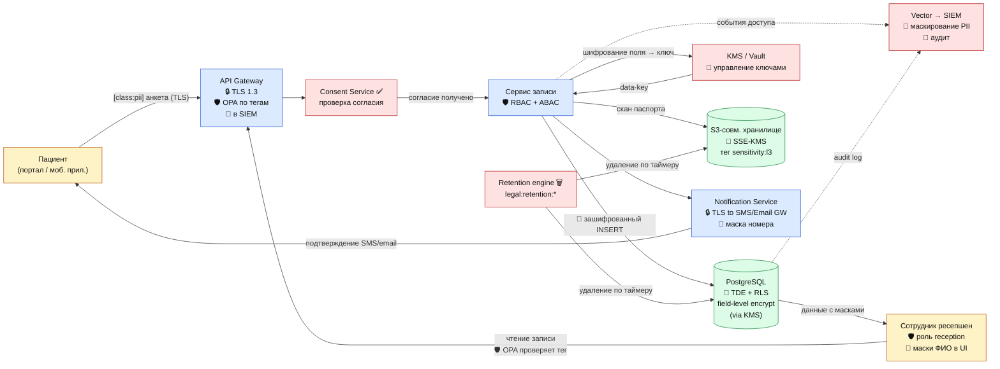

# DFD 1 (To-Be) — Запись пациента на приём + средства защиты

## Что добавлено относительно As-Is

| Этап | Инструмент | Какой тег срабатывает |
|------|------------|-----------------------|
| Канал клиент→портал | TLS 1.3 (Let's Encrypt / российский УЦ) | `protect:encrypt-in-transit` |
| API Gateway | OPA-плагин читает `sensitivity` + `domain` | `sensitivity:l3` → роль reception/patient |
| Consent Service | Проверка статуса согласия пациента | `legal:consent-required` |
| БД пациентов | PostgreSQL TDE + pgcrypto field-level | `protect:encrypt-at-rest`, `protect:field-level-encrypt` |
| Хранилище сканов | S3 SSE-KMS + object tags | `class:pii-special`, `sensitivity:l4` |
| Логи | Vector маскирует ФИО, телефон | `protect:mask-in-logs` |
| UI ресепшена | Маски в Web-формах | `protect:mask-in-ui` |
| SIEM | Алерт на чтение L4 без роли doctor | — |
| Retention Engine | Удаляет записи без активности 3 года | `legal:retention:3y` (анкета без записи) |
