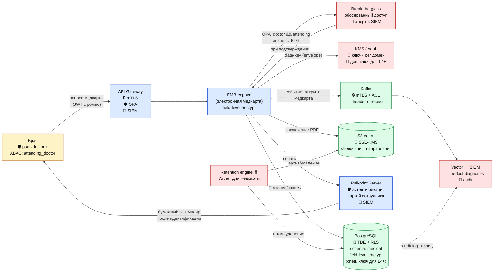

# DFD 2 (To-Be) — Приём специалистом и ведение медкарты + средства защиты

## Что добавлено относительно As-Is

| Этап | Инструмент | Тег |
|------|------------|-----|
| API доступа врача | OPA-политика `doctor && attending_doctor == current_user` | `domain:medical`, `sensitivity:l4` |
| Break-the-glass | Обоснованный доступ к чужому пациенту с обязательной фиксацией причины | `class:medical`, `sensitivity:l4` |
| Спец. категории (ВИЧ и пр.) | Отдельный ключ KMS, отдельная схема `medical_sensitive` | `class:medical-sensitive`, `sensitivity:l4-plus` |
| Печать | Pull-printing с картой сотрудника | — |
| Kafka-события | mTLS + ACL, header `x-data-tags` для downstream | все теги переносятся в lineage |
| SIEM | Алерт на BTG, на массовое чтение, на доступ к L4+ | — |
| Retention | 75 лет для медкарт (как первичная медицинская документация) | `legal:retention:75y` |
