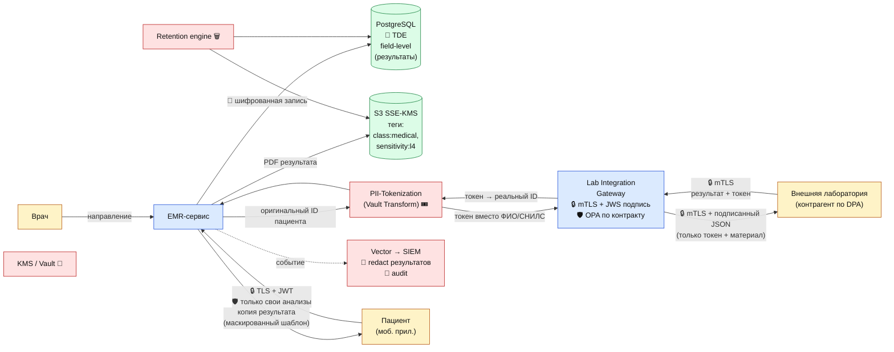

# DFD 3 (To-Be) — Лабораторные анализы + средства защиты

## Что добавлено относительно As-Is

| Этап | Инструмент | Тег |
|------|------------|-----|
| Канал с лабораторией | mTLS + JWS-подпись запросов, формализованный DPA | `protect:encrypt-in-transit` |
| Идентификатор пациента у внешнего контрагента | **Токенизация** через Vault Transform: лаборатория получает только токен | `protect:tokenize` |
| Хранение PDF результатов | S3 SSE-KMS + теги | `class:medical`, `sensitivity:l4` |
| Доступ пациента | Только к собственным анализам (`subject == current_user`) | `domain:patient` |
| Лог-сервис | Redact значений результатов в логах | `protect:mask-in-logs` |
| Retention | Анализы по правилам хранения медкарты | `legal:retention:25y` |
| Аудит | Алерт на массовую выгрузку анализов одним пользователем | — |
