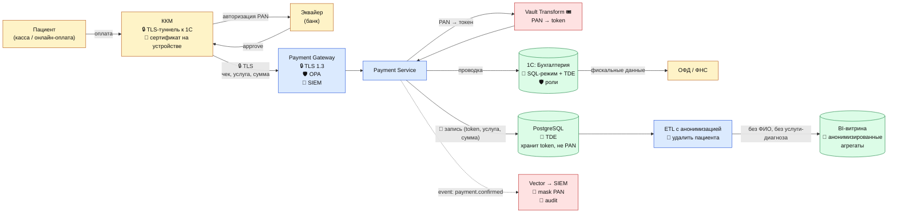

# DFD 4 (To-Be) — Приём оплаты услуг + средства защиты

## Что добавлено относительно As-Is

| Этап | Инструмент | Тег |
|------|------------|-----|
| ККМ ↔ 1С | TLS-туннель + сертификат на устройстве | `protect:encrypt-in-transit` |
| PAN | Токенизация Vault Transform — в системах хранится только токен | `protect:tokenize`, `class:payment-card` |
| 1С: Бухгалтерия | Перевод в клиент-серверный режим, TDE, роли пользователей | `protect:encrypt-at-rest` |
| Журнал оплат | Из Excel убирается; единая БД с TDE и аудитом | `class:financial`, `sensitivity:l3` |
| Логи | Маска PAN: 1234 **** **** 5678 | `protect:mask-in-logs` |
| BI / P&L | Анонимизация: удаляется ID пациента, услуга обобщается до категории | `protect:anonymize` |
| Аудит | SIEM-алерт на ручную правку платежей задним числом | — |
