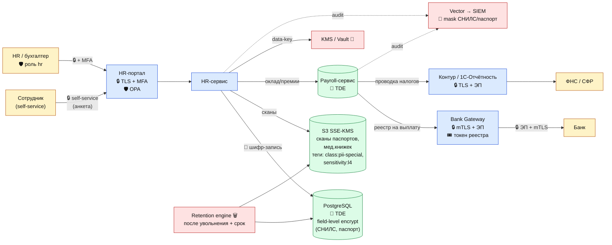

# DFD 5 (To-Be) — Бухгалтерия, зарплаты, кадровый учёт + средства защиты

## Что добавлено относительно As-Is

| Этап | Инструмент | Тег |
|------|------------|-----|
| Доступ HR | MFA + OPA-политика | `class:hr`, `sensitivity:l3` |
| Сканы документов | S3 SSE-KMS, теги | `class:pii-special`, `sensitivity:l4` |
| СНИЛС, паспорт, ИНН | Vault Transform — токенизация | `protect:tokenize` |
| Реестры в банк | mTLS + усиленная ЭП, токены вместо ПДн там, где можно | `protect:encrypt-in-transit` |
| Логи | Маскирование номеров документов | `protect:mask-in-logs` |
| Retention | Срок хранения после увольнения (75 лет — личные дела, 5 лет — ЗП) | `legal:retention:75y` / `5y` |
| Аудит | Алерт на чтение кадровых документов вне рабочих часов | — |
