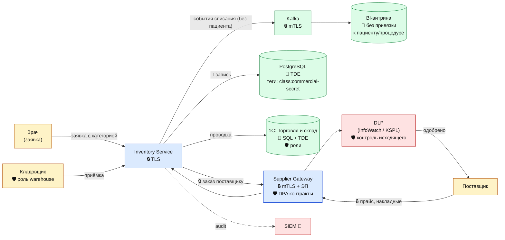

# DFD 6 (To-Be) — Учёт ТМЦ и закупки + средства защиты

## Что добавлено относительно As-Is

| Этап | Инструмент | Тег |
|------|------------|-----|
| Канал с поставщиками | mTLS + ЭП, защищённый EDI-формат | `protect:encrypt-in-transit` |
| Документы | S3 SSE-KMS + теги | `class:commercial-secret` |
| 1С: Торговля и склад | Клиент-серверный режим + роли + TDE | `protect:encrypt-at-rest` |
| Витрина BI | Списания идут как агрегаты без привязки к пациенту | `protect:anonymize` |
| DLP | Контроль исходящих писем поставщикам на утечку прайсов и контактов | — |
| Аудит | Алерт на массовую выгрузку прайсов поставщиков | — |
