# C4 Level 2 — Container-диаграмма целевой системы

Диаграмма уровня Container раскрывает «Медикаменте» и показывает **бизнес-сервисы**,
**хранилища** и **специализированные блоки Privacy by Design (PbD)**, которые
обслуживают все потоки данных в системе.

PbD-блоки на диаграмме выделены в **отдельный boundary «Privacy & Security
Platform»**, что подчёркивает их сквозной характер: они вызываются (или
прозрачно встраиваются) каждым прикладным контейнером.

## Диаграмма (Mermaid C4)

```mermaid
C4Container
    title Container-диаграмма (Level 2) — «Медикаменте» MVP с блоками Privacy by Design

    Person(patient, "Пациент", "Моб. приложение / ЛК")
    Person(staff, "Сотрудник", "Reception / Doctor / Cashier / HR / Storekeeper")
    Person(analyst, "Аналитик / Data Scientist", "Работает с обезличенными данными")
    Person(dpo, "DPO / SecOps", "Управление согласиями, аудит")

    System_Ext(esia, "ЕСИА", "OAuth 2.0 / OIDC")
    System_Ext(lab, "Внешняя лаборатория")
    System_Ext(bank, "Банк / Эквайер")
    System_Ext(suppliers, "Поставщики")
    System_Ext(sms, "SMS / Push / Email GW")

    System_Boundary(medikamente, "Система «Медикаменте»") {

        Container_Boundary(edge, "Edge / Доступ") {
            Container(webapp, "Patient Web/Mobile App", "React Native, React", "Личный кабинет, запись, чат, оплата")
            Container(staffapp, "Staff Workspace", "React", "Рабочее место сотрудника")
            Container(api_gw, "API Gateway + PbD Plugins", "Kong / Yandex API GW", "TLS 1.3, JWT, OPA-проверки, rate-limit, masking responses")
        }

        Container_Boundary(business, "Прикладные сервисы (Domain)") {
            Container(svc_patient, "Patient Service", "Java, Spring", "Управление пациентами и анкетами")
            Container(svc_emr, "EMR Service", "Java, Spring", "Электронная медкарта, диагнозы, назначения")
            Container(svc_appointment, "Appointment Service", "Java, Spring", "Запись на приём, расписание врачей")
            Container(svc_notif, "Notification Service", "Java", "Уведомления через SMS/Push/Email")
            Container(svc_payment, "Payment Service", "Java", "Платежи, эквайринг, фискализация")
            Container(svc_lab, "Lab Integration Service", "Java", "Интеграция с лабораторией по API")
            Container(svc_consent_ui, "Consent UI / Self-Service", "React", "Согласия, право на удаление")
            Container(svc_inv, "Inventory Service", "Java", "Учёт ТМЦ, заказы поставщикам")
            Container(svc_hr, "HR / Payroll Service", "Java / 1C-сервер", "Кадры, зарплаты, отчётность")
        }

        Container_Boundary(pbd, "Privacy & Security Platform — PbD-блоки") {
            Container(kms, "KMS / Vault", "HashiCorp Vault / Yandex KMS", "Управление ключами, envelope encryption, ротация")
            Container(tok, "PII Tokenization", "Vault Transform", "Токенизация СНИЛС, ИНН, PAN, телефонов")
            Container(catalog, "Data Catalog + Tagging", "Apache Atlas / OpenMetadata", "Реестр данных, теги чувствительности, lineage")
            Container(consent, "Consent Management Service", "Java + ЭП ЕСИА", "Сбор, отзыв согласий, реестр обработки")
            Container(opa, "Policy Decision Point", "OPA / Cedar", "ABAC по тегам и контексту")
            Container(retention, "Retention Engine", "Java + cron / Airflow", "Удаление / обезличивание по срокам и запросам субъекта")
            Container(siem, "Audit / SIEM", "Elastic + Wazuh", "Журналирование, корреляция событий, алерты")
            Container(dlp, "DLP Service", "InfoWatch / Kaspersky DLP", "Контроль исходящих и DLP-проверки в CI/CD")
            Container(privacy_ui, "DPO Console", "React", "Реестр согласий, обращения, аудит, инциденты")
        }

        Container_Boundary(data, "Хранилища (домены данных)") {
            ContainerDb(db_patient, "Patient DB", "PostgreSQL + TDE + RLS", "Анкеты, контакты. Зашифровано полем.")
            ContainerDb(db_emr, "EMR DB", "PostgreSQL + TDE + RLS", "Медкарта. Отдельный ключ KMS.")
            ContainerDb(db_emr_sensitive, "Sensitive EMR DB", "PostgreSQL + TDE + RLS", "L4+ диагнозы (ВИЧ и т.п.). Отдельный ключ + ABAC.")
            ContainerDb(db_payment, "Payment DB", "PostgreSQL + TDE", "Токены платежей, суммы.")
            ContainerDb(db_inv, "Inventory DB", "PostgreSQL + TDE", "ТМЦ, цены.")
            ContainerDb(db_hr, "HR DB", "1C / PostgreSQL + TDE", "Кадровые данные.")
            ContainerDb(s3, "Object Storage", "S3-совместимое + SSE-KMS", "Сканы, PDF заключений, накладные.")
            ContainerDb(bus, "Event Bus", "Apache Kafka, mTLS, ACL", "Доменные события с тегами в header.")
        }

        Container_Boundary(analytics, "Analytics Layer — PbD-Aware") {
            Container(anon, "Anonymization Pipeline", "Spark + ARX", "Псевдонимизация / k-anonymity / дифф. приватность")
            ContainerDb(lake, "Privacy-aware Data Lake", "S3 + Iceberg", "Сырые события с тегами, доступ только сервисам PbD")
            ContainerDb(mart, "Anonymized Data Marts", "ClickHouse", "BI-витрины без L4+ данных")
            Container(bi, "BI / Notebooks", "DataLens / JupyterHub", "Дашборды и ML-эксперименты на витринах")
        }
    }

    Rel(patient, webapp, "Использует", "HTTPS")
    Rel(staff, staffapp, "Использует", "HTTPS + MFA")
    Rel(analyst, bi, "Строит отчёты, обучает модели", "HTTPS")
    Rel(dpo, privacy_ui, "Управляет согласиями, расследует инциденты", "HTTPS + MFA")

    Rel(webapp, esia, "Аутентификация", "OAuth 2.0")
    Rel(webapp, api_gw, "API-запросы", "HTTPS")
    Rel(staffapp, api_gw, "API-запросы", "HTTPS")

    Rel(api_gw, opa, "Проверка политик ABAC", "gRPC")
    Rel(api_gw, consent, "Проверка согласия", "gRPC")
    Rel(api_gw, siem, "Аудит запроса", "Kafka")

    Rel(api_gw, svc_patient, "REST", "HTTPS")
    Rel(api_gw, svc_emr, "REST", "HTTPS")
    Rel(api_gw, svc_appointment, "REST", "HTTPS")
    Rel(api_gw, svc_payment, "REST", "HTTPS")
    Rel(api_gw, svc_lab, "REST", "HTTPS")
    Rel(api_gw, svc_consent_ui, "REST", "HTTPS")
    Rel(api_gw, svc_inv, "REST", "HTTPS")
    Rel(api_gw, svc_hr, "REST", "HTTPS")

    Rel(svc_patient, kms, "Получить data-key", "gRPC")
    Rel(svc_patient, tok, "Токенизация СНИЛС / телефона", "gRPC")
    Rel(svc_patient, db_patient, "🔐 чтение/запись", "SQL/TLS")
    Rel(svc_patient, catalog, "Регистрация тегов на колонках", "REST")

    Rel(svc_emr, kms, "Data-key (envelope)", "gRPC")
    Rel(svc_emr, opa, "ABAC при доступе к карте", "gRPC")
    Rel(svc_emr, db_emr, "🔐 чтение/запись", "SQL/TLS")
    Rel(svc_emr, db_emr_sensitive, "🔐 спец-ключ для L4+", "SQL/TLS")
    Rel(svc_emr, s3, "Сканы, PDF", "HTTPS")
    Rel(svc_emr, bus, "Domain events с тегами", "Kafka mTLS")

    Rel(svc_appointment, bus, "appointment.created/changed", "Kafka mTLS")
    Rel(svc_appointment, svc_notif, "Запросить уведомление", "REST")
    Rel(svc_notif, sms, "Отправка", "TLS")

    Rel(svc_payment, tok, "PAN ↔ токен", "gRPC")
    Rel(svc_payment, bank, "Авторизация", "mTLS")
    Rel(svc_payment, db_payment, "🔐 запись", "SQL/TLS")

    Rel(svc_lab, tok, "Токен пациента вместо ФИО", "gRPC")
    Rel(svc_lab, lab, "Направления / результаты", "mTLS + JWS")
    Rel(svc_lab, db_emr, "🔐 запись результата", "SQL/TLS")

    Rel(svc_inv, db_inv, "🔐", "SQL/TLS")
    Rel(svc_inv, suppliers, "Заказы / накладные", "mTLS")

    Rel(svc_hr, kms, "Data-key", "gRPC")
    Rel(svc_hr, db_hr, "🔐", "SQL/TLS")

    Rel(svc_consent_ui, consent, "Сбор согласий, отзыв", "REST")
    Rel(consent, esia, "ЭП согласия", "REST")
    Rel(retention, consent, "Триггер по отзыву согласия", "Kafka")
    Rel(retention, db_patient, "Удаление / обезличивание", "SQL")
    Rel(retention, db_emr, "Архивация / удаление", "SQL")
    Rel(retention, s3, "Удаление", "HTTPS")
    Rel(retention, bus, "subject.erased", "Kafka")

    Rel(dlp, bus, "Анализ событий с тегами", "Kafka")
    Rel(dlp, siem, "Инциденты DLP", "Kafka")
    Rel(siem, privacy_ui, "Инциденты DPO", "REST")

    Rel(bus, lake, "События в Data Lake", "Kafka Connect")
    Rel(anon, lake, "Чтение сырых событий", "S3 SDK")
    Rel(anon, mart, "Запись обезличенных витрин", "JDBC")
    Rel(anon, catalog, "Чтение тегов для решения о маскировании", "REST")
    Rel(bi, mart, "Чтение витрин", "JDBC")
    Rel(bi, opa, "Проверка доступа аналитика", "gRPC")

    UpdateLayoutConfig($c4ShapeInRow="3", $c4BoundaryInRow="1")
```

## Семь принципов Privacy by Design на этой диаграмме

| Принцип PbD | Где реализован |
|-------------|----------------|
| 1. Проактивность | DLP в CI/CD, проверки контрактов API на этапе релиза, регулярные PIA |
| 2. Privacy as default | API GW + OPA отдают только разрешённое; маски в логах по тегам |
| 3. Privacy embedded into design | Все сервисы прозрачно ходят в KMS / Tokenization — PbD не «надстройка», а часть платформы |
| 4. Full functionality | Бизнес-функции (запись, оплата, ЭМК) реализуются полностью — PbD не ломает UX |
| 5. End-to-end security | TLS/mTLS на всех каналах; шифрование at-rest на всех БД; field-level для L4+ |
| 6. Visibility & transparency | SIEM + DPO Console + Data Catalog с lineage; пациент видит, что и кому о нём известно |
| 7. Respect for user privacy | Consent Service, Self-Service «удалить мои данные», Retention Engine |

## Что важно отметить

- **Sensitive EMR DB** вынесена в отдельный контейнер с собственным ключом — это
  технически закрывает риск утечки спец. категорий ПДн.
- **Event Bus (Kafka)** переносит **только теги** на уровне header, что позволяет
  downstream-сервисам (DLP, Retention, Anonymization Pipeline) принимать решения
  без расшифровки полезной нагрузки.
- **Analytics Layer вынесен в отдельный boundary** и взаимодействует с операционными
  данными исключительно через **Anonymization Pipeline** — это запрещает аналитику
  работать с raw-ПДн напрямую. Подробнее — в [`analytics_layer.md`](analytics_layer.md).
- **Retention Engine** слушает события `consent.revoked`, `subject.erasure_requested`
  и публикует обратное событие `subject.erased`, чтобы downstream-витрины тоже
  отбросили данные.
- **DPO Console** — единая точка для офицера данных: согласия, обращения, инциденты
  безопасности, отчёты соответствия. Это закрывает принцип «visibility & transparency».
