# C4 Level 1 — Контекстная диаграмма целевого состояния «Медикаменте»

Диаграмма уровня System Context показывает целевую систему «Медикаменте» как чёрный
ящик и её взаимодействие с пользователями и внешними системами. Принципы Privacy by
Design на этом уровне отражены в том, что **все внешние взаимодействия с
конфиденциальными данными идут через шифрованные, аудируемые и согласованные
каналы**.

## Диаграмма (Mermaid C4)

```mermaid
C4Context
    title Контекстная диаграмма (Level 1) — целевая система «Медикаменте»

    Person(patient, "Пациент", "Пользователь моб. приложения и личного кабинета. Источник и владелец своих ПДн и мед. данных.")
    Person(reception, "Сотрудник ресепшен", "Принимает записи, заключает контракты.")
    Person(doctor, "Медицинский специалист", "Ведёт приём, медкарту, назначения.")
    Person(cashier, "Кассир", "Принимает оплату.")
    Person(accountant, "Бухгалтер / HR", "Бухучёт, кадры, зарплата.")
    Person(storekeeper, "Кладовщик", "Учёт ТМЦ.")
    Person(analyst, "Бизнес-аналитик / Data Scientist", "BI, ML, AI. Имеет доступ ТОЛЬКО к обезличенным данным.")
    Person(dpo, "DPO / Офицер безопасности", "Мониторинг согласий, инцидентов, аудит.")

    System(medikamente, "Система «Медикаменте»", "Единая платформа: запись, ЭМК, оплата, склад, BI. Все блоки PbD встроены.")

    System_Ext(lab, "Внешняя лаборатория", "Партнёр по DPA. Получает ТОЛЬКО токены пациентов, обмен по mTLS.")
    System_Ext(bank, "Банк / Эквайер", "Авторизация платежей, зарплатный проект. PAN никогда не покидает токенайзер.")
    System_Ext(ofd, "ОФД / ФНС", "Фискальные данные, отчётность.")
    System_Ext(sfr, "СФР", "Социальное страхование, отчётность по работникам.")
    System_Ext(suppliers, "Поставщики ТМЦ", "Закупки, накладные. Канал mTLS + ЭП.")
    System_Ext(sms, "SMS / Push / Email Gateway", "Уведомления. Содержимое маскируется.")
    System_Ext(rkn, "Роскомнадзор", "Реестр операторов ПДн, обращения субъектов.")
    System_Ext(idp, "Госуслуги ЕСИА", "Аутентификация пациентов и юридически значимая ЭП согласий.")

    Rel(patient, medikamente, "Запись, ЛК, чат, оплата", "HTTPS (TLS 1.3) + JWT (через ЕСИА)")
    Rel(patient, idp, "Вход и подписание согласия", "OAuth 2.0 / OIDC")

    Rel(reception, medikamente, "Управление записями", "HTTPS + MFA")
    Rel(doctor, medikamente, "Ведение ЭМК, назначения", "HTTPS + MFA + ABAC")
    Rel(cashier, medikamente, "Касса", "HTTPS + MFA")
    Rel(accountant, medikamente, "Бухгалтерия, кадры, ЗП", "HTTPS + MFA")
    Rel(storekeeper, medikamente, "Учёт ТМЦ", "HTTPS + MFA")
    Rel(analyst, medikamente, "Доступ к BI-витринам", "HTTPS, ТОЛЬКО обезличенные данные")
    Rel(dpo, medikamente, "Аудит, реестр согласий, реакция на инциденты", "HTTPS, привилегированный доступ")

    Rel(medikamente, lab, "Направления и результаты анализов", "mTLS + JWS, токены вместо ПДн")
    Rel(medikamente, bank, "Платежи, реестры ЗП", "mTLS + ЭП, токенизация PAN")
    Rel(medikamente, ofd, "Фискальные чеки", "TLS, агрегаты")
    Rel(medikamente, sfr, "Отчёты по сотрудникам", "TLS + ЭП")
    Rel(medikamente, suppliers, "Заказы, накладные", "mTLS + ЭП")
    Rel(medikamente, sms, "Уведомления пациентам", "TLS, маска ПДн")
    Rel(medikamente, rkn, "Уведомление об обработке, обращения субъектов", "Госуслуги / СМЭВ")
    Rel(medikamente, idp, "Проверка токена", "OAuth 2.0")

    UpdateLayoutConfig($c4ShapeInRow="3", $c4BoundaryInRow="2")
```

## Расшифровка ключевых решений на уровне контекста

| # | Решение | Какой риск/принцип PbD закрывает |
|---|---------|----------------------------------|
| 1 | Все каналы — TLS 1.3 или mTLS | Принцип «End-to-end security» |
| 2 | Аутентификация пациента через **ЕСИА** | Снижает риск кражи учётки, упрощает юридически значимое подписание согласия |
| 3 | Внешняя лаборатория получает **только токены** пациента | «Data minimization» при передаче третьим лицам |
| 4 | Аналитик работает с системой, но через отдельный путь к **обезличенным витринам** | «Privacy by default» — нет доступа к raw-ПДн без обоснования |
| 5 | Отдельный актор **DPO** | «Visibility & transparency», управление инцидентами |
| 6 | Канал к РКН — для исполнения «права быть забытым» | «Respect for user privacy» |
| 7 | Платёжные данные на уровне контекста не входят внутрь «Медикаменте» в виде PAN — есть токенизация | Сокращение зоны PCI DSS и ущерба при утечке |

## Границы системы

В целевую систему **«Медикаменте» входят**: портал пациента, мобильное приложение,
ЭМК, CRM, платёжный шлюз, склад, бухгалтерия (через 1С-сервер), аналитическая
платформа, инфраструктурные сервисы PbD (KMS, OPA, Consent, Catalog, SIEM, DLP,
Retention). Детальное разложение — в [`c4_container.md`](c4_container.md).

Из системы **исключены**: банки, лаборатория, ОФД, ФНС, СФР, поставщики, SMS-шлюзы,
ЕСИА — это внешние системы, с которыми взаимодействие идёт по контрактам и
шифрованным каналам.
