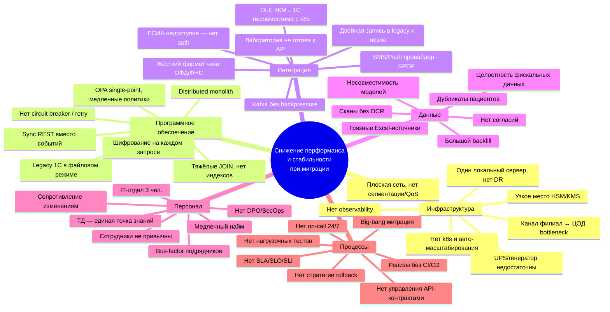

# Диаграмма Исикавы — узкие места миграции (Markdown-версия)

Исходный draw.io-файл — [`ishikawa.drawio`](ishikawa.drawio). Эта же диаграмма
дублирована в Markdown — для просмотра прямо в репозитории.

## Голова рыбы

> **Снижение производительности и стабильности системы при миграции монолита
> «Медикаменте» на микросервисную архитектуру**

## Шесть категорий причин

```
Инфраструктура   Программное ПО   Интеграция
        \             |             /
         \            |            /
          \           |           /
           +----------+----------+
           |                     |
           +----> Снижение перформанса
           |     и стабильности при миграции
           +----------+----------+
          /           |           \
         /            |            \
        /             |             \
   Данные         Персонал         Процессы
```

## Mermaid-визуализация (упрощённая)



## ASCII-схема (классическая «рыбья кость»)

```
   Инфраструктура       Программное ПО          Интеграция
     \                       \                       /
      \--<один сервер>        \--<dist monolith>   <--OLE ККМ↔1С>
       \--<плоская сеть>       \--<sync REST>      <--лаборатория без API>
        \--<нет k8s>            \--<нет CB/retry>  <--жёсткий формат чека>
         \--<HSM SPOF>           \--<JOIN/индексы> <--Kafka без backpressure>
          \--<канал WAN>          \--<KMS перегруз><--двойная запись>
           \--<нет observ.>        \--<OPA SPOF>   <--ЕСИА недоступна>
            \--<UPS малый>          \--<legacy 1С> <--SMS/Push SPOF>
             \                       \                /
              \                       \              /
               \                       \            /
                ====================================>  Снижение перформанса
               /                       /            \   и стабильности
              /                       /              \  при миграции
             /                       /                \
            /                       /                  \
           /--<грязные Excel>       /--<3 IT-чел.>      \--<нет CI/CD>
          /--<сканы без OCR>       /--<сотр. не привык> \--<нет нагрузки>
         /--<дубликаты>           /--<нет DPO>           \--<нет rollback>
        /--<backfill>            /--<ТД — SPOF знаний>   \--<нет 24/7>
       /--<нет согласий>        /--<медленный найм>      \--<big-bang>
      /--<несовм. модели>      /--<сопротивление>        \--<нет SLA/SLO>
     /--<фискальные данные>   /--<bus-factor подрядч.>   \--<нет API-контракт.>
    /                        /                            \
   Данные                  Персонал                       Процессы
```

## Категории и потенциальные проблемы (детально)

### 🟦 1. Инфраструктура

| # | Потенциальная проблема | Чем грозит |
|---|------------------------|------------|
| I1 | Один локальный сервер, нет резерва/DR | Полная остановка приёма пациентов при сбое |
| I2 | Плоская сеть, нет сегментации / QoS | Тормоза трафика, нарушение УЗ-1 |
| I3 | Нет Kubernetes и авто-масштабирования | Невозможно поднять реплики при пиках |
| I4 | HSM/KMS — единая точка отказа | Расшифровка останавливается → деградация всех L3+ операций |
| I5 | Канал филиал ↔ ЦОД ограничен | Lat-критичные операции (запись, касса) тормозят |
| I6 | Нет observability (метрик/трейсов/логов) | Невозможно найти источник проблем |
| I7 | UPS и генератор недостаточны | Простой при отключении электричества > 30 мин |

### 🟦 2. Программное обеспечение

| # | Потенциальная проблема | Чем грозит |
|---|------------------------|------------|
| S1 | «Distributed monolith» — слишком сильная связность сервисов | Любое изменение требует деплоя всего |
| S2 | Синхронные REST-цепочки | Каскадные таймауты → 5xx у пациента |
| S3 | Нет circuit breaker / retry / bulkhead | Один зависший сервис кладёт остальные |
| S4 | Тяжёлые JOIN-ы в БД, отсутствуют индексы | Деградация latency на росте данных |
| S5 | Шифрование на каждом запросе без кеша data-key | Перегрузка KMS → всё медленно |
| S6 | OPA single-point + медленные rego-политики | Все запросы тормозят / отказывают |
| S7 | 1С в файловом режиме под нагрузкой | Кассы и склад блокируются |

### 🟦 3. Интеграция

| # | Потенциальная проблема | Чем грозит |
|---|------------------------|------------|
| N1 | OLE ККМ↔1С завязана на Windows-десктоп | Кассы нельзя перенести в k8s «как есть» |
| N2 | Лаборатория не готова к API | Сохраняется e-mail-канал, не закрыт risk утечки |
| N3 | Жёсткий формат чека ОФД/ФНС | Любые ошибки → штрафы налоговой |
| N4 | Kafka без backpressure / без квот | Overflow → потеря событий или OOM |
| N5 | Двойная запись в legacy 1С и новые сервисы | Рассинхронизация финансов и склада |
| N6 | ЕСИА недоступна | Пациенты не могут войти в ЛК |
| N7 | SMS/Push провайдер — единственный | Пациенты не получают уведомления о приёме |

### 🟩 4. Данные

| # | Потенциальная проблема | Чем грозит |
|---|------------------------|------------|
| D1 | Грязные неоднородные Excel-источники | Ошибки миграции, потеря записей |
| D2 | Сканы PDF/JPG без OCR | Часть данных не структурируется → анализ ограничен |
| D3 | Дубликаты пациентов (нет уникального ID) | Дублирование медкарт, неверная аналитика |
| D4 | Большой объём backfill | Долгая первичная миграция, замедление прод-нагрузки |
| D5 | Нет согласий на обработку | Часть данных нельзя переносить юридически |
| D6 | Несовместимость моделей (монолит ↔ домены) | Нужны сложные правила трансформации |
| D7 | Целостность фискальных данных при переходе | Ошибки в отчётности перед ФНС |

### 🟩 5. Персонал

| # | Потенциальная проблема | Чем грозит |
|---|------------------------|------------|
| P1 | IT-отдел всего 3 человека | Не хватает SecOps, SRE, DevOps, DPO |
| P2 | Сотрудники не привычны к новой системе | Снижение скорости приёма, ошибки ввода |
| P3 | Нет DPO и SecOps в штате | Compliance-задолженность, риск штрафов |
| P4 | ТД — единая точка знаний по архитектуре | bus-factor 1, потеря критичных знаний |
| P5 | Медленный найм на специфический стек (Java + k8s + 1С) | Срыв сроков MVP |
| P6 | Сопротивление изменениям со стороны бизнеса | Затягивание принятия решений, скрытое сопротивление |
| P7 | Bus-factor подрядчиков на лаборатории и 1С | Зависимость от внешних исполнителей |

### 🟩 6. Процессы

| # | Потенциальная проблема | Чем грозит |
|---|------------------------|------------|
| R1 | Релизы без CI/CD, деплой вручную | Ошибки в продакшене из-за конфигов |
| R2 | Нет нагрузочного тестирования | Прод деградирует под реальной нагрузкой |
| R3 | Нет стратегии rollback | Откат болезненный или невозможный |
| R4 | Нет процесса инцидентов и on-call 24/7 | Долгие простои, отсутствие реакции ночью |
| R5 | Big-bang миграция | Высокий риск отказа всей системы одновременно |
| R6 | Нет SLA/SLO/SLI | Невозможно объективно измерить успех миграции |
| R7 | Нет управления API-контрактами | Поломки между командами, breaking changes |

## Использование диаграммы

- **Голова** фиксирует проблему, которую нужно избежать.
- **Кости** дают карту причинных областей.
- **Под-кости** — точечные риски, каждый из которых получает меру в
  [`recommendations.md`](recommendations.md).
- Отчёт с системным разбором — в [`report.md`](report.md).
